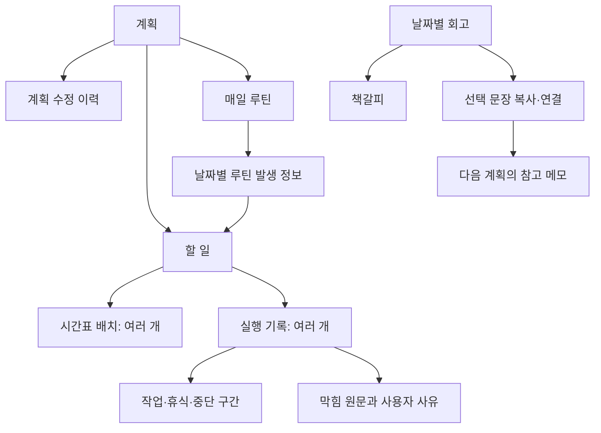
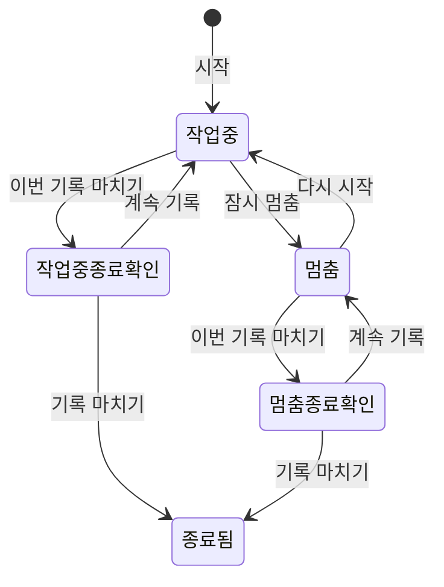

> **과거 기록:** 작성 시점의 설계·검토·검증 결과입니다. 현재 구현과 승인 기준은 [문서 시작점](../../README.md)을 따릅니다.

# PlanDoSee Diary — 핵심 데이터 관계 설계 v1.1

- 작성일: 2026-09-10
- 기준: `requirements-v1.md` v1.5와 일간 핵심 와이어프레임 검토 결과
- 단계: 핵심 데이터 설계. 실제 DB·API·화면·테스트는 미구현
- 목적: 기록의 연결·시간 계산·루틴·삭제 경계를 정하고 와이어프레임과 페이지 구조의 입력 자료로 사용한다.
- 구분: 합의한 요구사항은 유지한다. 아래의 구체화는 설계안이며 실제 스키마나 새로 받은 사용자 승인을 의미하지 않는다.
- 예시는 모두 설계 검토용 가상 값이다. 사용자의 실제 실행 기록으로 저장하지 않는다.

## 1. 핵심 결론

계획, 할 일, 시간표 배치, 실행 기록을 서로 다른 자료로 둔다. 루틴은 날짜별 할 일을 생성하는 규칙으로 연결한다. 회고는 날짜별 독립 기록이며 사용자가 선택한 문장을 다음 계획에 복사·연결한다.

| 자료 | 뜻 | 예시 | 구분 이유 |
|---|---|---|---|
| 계획 | 기간과 성공 기준을 가진 목표 | 9월 독서 계획 | 처음 계획과 수정 이력을 보존 |
| 할 일 | 완료 여부를 판단하는 단위 | 책 1장 읽기 | 시간표 블록 수와 완료 수를 분리 |
| 시간표 배치 | 언제 하기로 했는지 | 오전 30분·오후 20분 | 하나의 할 일을 여러 번 배치 |
| 실행 기록 | 한 번 시작해 종료한 실제 활동 | 오전에 실제 25분 작업 | 계획을 덮어쓰지 않고 여러 실행 연결 |
| 시간 구간 | 실행 중 작업·휴식·중단의 전환 | 작업 15분·휴식 5분·작업 10분 | 전체 경과와 작업 시간을 따로 계산 |
| 루틴 | 같은 일을 매일 계획하는 규칙 | 매일 09:00 독서 30분 | 날짜별 완료 여부를 독립 관리 |
| 일간 회고 | 하루에 대한 사용자 원문 | 다음에는 준비를 먼저 하자 | 계획 하나 삭제로 하루 회고를 잃지 않음 |

통계와 PDF는 위 자료에서 계산한다. 별도의 편집 가능한 ‘완료 개수’ 값을 정답처럼 저장하지 않는다.

## 2. 저장할 개념과 최소 정보

아래는 논리적 자료 목록이다. 실제 테이블 수·DB 타입·필드명·인덱스는 물리 데이터 설계에서 결정한다.

| 개념 | 핵심 정보 | 관계·규칙 |
|---|---|---|
| 공개 다이어리 | ID, 제목, 시간대 | 이번 버전 하나. 사용자 인증·소유권 검증을 대신하지 않음 |
| 계획 | ID, 제목, 기간, 성공 기준, 우선순위, 예상 시간, 상태, 버전 | 공개 다이어리에 속함. 현재 값과 최초·이전 버전 보존 |
| 할 일 | ID, 계획 ID, 제목·설명, 마감 날짜, 우선순위, 예상 시간, 완료 상태·시각, 버전 | 계획 하나에 속함. 실행·배치·루틴 여부와 완료 상태는 별개 |
| 할 일 태그 | ID, 이름, 연결된 할 일 | 여러 태그 연결 가능. 중단 사유와 다른 목록 |
| 시간표 배치 | ID, 할 일 ID, 예정 시작·종료, 버전 | 할 일당 여러 개. 예정 시각 정정은 실제 실행에 영향 없음 |
| 루틴 규칙 | ID, 계획 ID, 제목, 기간, 매일 시각, 예상 시간, 상태, 규칙 버전 | 날짜별 할 일 생성의 원본. 외부 AI·달력 서비스 필요 없음 |
| 루틴 날짜 정보 | 루틴 ID, 기준 날짜, 적용 규칙 버전, 할 일 ID, 개별 수정·취소 상태 | 같은 루틴·기준 날짜 한 개. 개별 예외를 전체 규칙과 분리 |
| 실행 기록 | ID, 할 일 ID, 시작·종료, 종료 후보 시각, 현재 상태, 버전 | 날짜별 배치에 반드시 속할 필요는 없음. 예정 외 실행도 기록 가능 |
| 시간 구간 | ID, 실행 ID, 종류, 시작·종료 | 작업·휴식·중단·미분류 멈춤. 실행 안에서 겹치지 않음 |
| 막힘 기록 | ID, 실행 ID, 선택적 구간 ID, 원문, 선택적 사유 ID | 작업을 계속하면서 막힘을 적을 수 있음. 실행당 여러 번 가능 |
| 중단 사유 | ID, 이름, 보관 여부 | 사용자 직접 관리. 이름 수정과 특정 기록 재분류를 구분 |
| 일간 회고 | ID, 서울 날짜, 선택적 답변 1개, 작성·수정 시각, 버전 | 날짜당 하나. 연결 계획은 별도로 연결하고 의존 삭제하지 않음 |
| 하루 마감 상태 | 서울 날짜, 마감 여부, 회고 작성 여부 | 공백으로 마쳐도 허용하며 기록 수정은 막지 않음 |
| 책갈피 | ID, 회고 ID, 전체/문장 구분, 발췌 내용·원문 버전 | 특정 문장은 발췌를 보존하고 출처로 이동 가능 |
| 계획 전달 메모 | ID, 새 계획 ID, 원본 회고 연결, 선택 문장 복사본 | 원본을 나중에 고쳐도 붙인 문장을 조용히 바꾸지 않음 |
| 수정 이력 | 대상, 버전, 변경 전후, 변경 시각·유형 | 계획·할 일·배치·실행 등 필요한 정정 이력. 인증된 수정자로 꾸미지 않음 |
| 삭제 묶음 | ID, 삭제 대상과 함께 이동한 자료, 삭제·복원 기한 | 부모 삭제와 개별 삭제의 범위를 구분 |
| 저장 요청 식별 | 요청 키, 동작, 요청 내용 식별, 처리 결과 참조 | 같은 요청의 재시도가 완료·실행·루틴을 중복 생성하지 않음 |

‘로그인이 없으므로 작성자 ID를 임의로 만드는 방식’은 쓰지 않는다. 향후 소유자 연결은 별도 권한 설계다.

## 3. 절대 섞지 않을 연결

### 3.1 한 할 일의 여러 배치와 여러 실행

예상 60분인 할 일을 오전·오후 각 30분에 배치하고 실제로 25분·40분 실행했다면:

- 할 일 수: 1
- 시간표 배치 수: 2
- 실행 기록 수: 2
- 예상 시간: 60분
- 실제 시간: 65분
- 차이: +5분

실행 저장은 배치를 완료로 덮어쓰는 동작이 아니다. 실행과 배치의 선택적 연결은 있어도 할 일 연결을 정답으로 사용한다. 첫 버전은 특정 배치 없이도 실행을 저장할 수 있어야 한다.

### 3.2 계획 예상과 할 일 예상

상위 계획의 예상 시간은 그 계획의 선언값으로 보존한다. 과제의 돌아보기 예상 합계는 대상 할 일 예상 시간만 더한다. 상위 계획과 할 일을 함께 더하지 않는다.

### 3.3 현재 값과 이력

- 수정할 때 ID는 유지하고 현재 버전을 증가시킨다.
- 이력과 현재 값은 함께 저장되어야 한다. 하나만 성공한 상태를 만들지 않는다.
- 이전 버전은 열람용이며 집계에 여러 번 포함하지 않는다.
- 사용자 사유 이름을 바꾸어도 원문은 보존한다.
- 수정 이력은 영구 삭제 정책을 무시하는 무제한 원문 보관소로 사용하지 않는다.

## 4. 실행 상태와 시간 구간

- 멈춤은 우선 미분류 구간으로 시작한다. 휴식·예상하지 못한 중단 분류와 이유는 재개 후 또는 기록 상세에서 선택적으로 정정한다.
- 공개 다이어리에서 열린 실행은 하나만 허용한다. 멈춤도 열린 실행이다.
- 새로고침·브라우저 종료로 상태를 초기화하지 않는다.
- 종료 확인 상태에는 사용자가 ‘이번 기록 마치기’를 처음 누른 종료 후보 시각과 직전 상태를 보존한다.
- ‘계속 기록’은 종료 후보 시각을 버리고 직전의 작업 중 또는 멈춤 상태로 돌아간다. ‘기록 마치기’는 종료 후보 시각으로 종료한다. 확인에 걸린 시간을 실행 시간에 추가하지 않는다.
- 같은 종료 확인·확정 요청이 반복되면 새 후보나 새 실행을 만들지 않고 기존 결과를 반환한다.
- 종료 저장이 확정되기 전에는 다음 실행을 시작하지 않는다.
- 할 일 완료는 실행 종료와 별도 선택이다. 이미 종료된 실행은 완료 취소 때문에 다시 열리지 않는다.
- 나누어 하는 작업은 하나의 실행을 오래 멈추는 대신 같은 할 일에 여러 실행으로 저장한다. 실행 사이의 시간은 휴식·중단·미분류 멈춤으로 자동 생성하지 않는다.

### 4.1 검증 불변식

1. 종료된 실행에는 시작·종료가 있으며 종료가 시작보다 늦다.
2. 종료된 실행의 모든 구간은 그 실행 범위 안에 있다.
3. 구간은 서로 겹치지 않고 전체 경과를 빠짐없이 덮는다. 빈 구간이 있으면 임의로 작업 시간으로 채우지 않고 수정 안내한다.
4. 공개 다이어리의 유효한 실제 실행끼리 시간 구간이 겹치지 않는다. 계획의 겹침 허용과는 다르다.
5. 전체 경과 = 작업 + 휴식 + 중단 + 미분류 멈춤.
6. 실제 시간 = 작업 구간의 합. 막힘 원문이 있다고 그 구간을 자동 차감하지 않는다.
7. 확정 통계에는 종료한 유효 실행만 포함한다.
8. 화면이 표시하는 진행 중 시간은 별도이며 확정 PDF 숫자에 더하지 않는다.
9. 서버에서 같은 요청 재시도와 상태 충돌을 구분한다. 같은 키로 다른 내용을 보내면 거부한다.
10. DB가 지원하는 제약·트랜잭션을 사용해 여러 탭에서도 위 규칙을 보장해야 한다. 아직 구현·검증하지 않았다.

## 5. 매일 루틴의 설계 구체화

### 5.1 날짜별 할 일 생성 — 제안하는 방식

루틴 저장 시 사용자가 지정한 시작일부터 종료일까지 날짜별 할 일과 배치를 생성하는 안을 채택한 설계로 검토한다. 생성될 날짜 범위와 개수를 저장 전에 보여준다.

이유: 일·주·월 화면이 같은 자료를 사용하고, 다음 날 앱을 열었는지에 따라 계획한 할 일 수가 달라지지 않는다. 매일 자정에 실행해야 하는 별도 유료 작업도 전제로 하지 않는다.

- 종료일이 있는 범위만 생성한다. 무한 미래를 생성하지 않는다.
- 한 루틴·기준 날짜는 한 번만 만든다. 재시도나 페이지 이동으로 중복 생성하지 않는다.
- 생성은 전부 확정되거나 실패 상태를 분명히 보여야 한다. 반만 생성하고 완료라고 표시하지 않는다.
- 날짜별 마감일은 그 발생 날짜, 예상 시간은 생성에 사용한 루틴 규칙값으로 둔다.
- 원본 루틴 변경과 개별 날짜 변경을 구분하려고 적용 규칙 버전과 개별 수정 표시를 남긴다.
- 실제 실행·완료·회고는 생성하지 않는다. 루틴은 계획만 만든다.
- 긴 기간의 생성 상한·일괄 처리 방식은 선택할 DB·서버 한도를 확인한 뒤 정한다. 아직 임의의 최대 날짜를 사용자 요구로 확정하지 않는다.

### 5.2 하루만 바꾸기

해당 날짜의 할 일과 배치만 수정하고 개별 예외로 남긴다. 같은 루틴의 다른 날짜나 원본 규칙은 바꾸지 않는다. 원래 발생 날짜는 식별용으로 유지하고 실제 배치 시각은 바뀔 수 있다.

### 5.3 이후 반복 바꾸기

적용 시작 날짜를 명시하고 새 규칙 버전을 만든다. 이후 날짜 중 실행을 시작하지 않았고 개별 수정·취소하지 않은 발생만 변경 대상으로 제시한다. 변경 전 배치는 이력으로 보존한다.

지난 날짜, 시작한 실행, 완료한 할 일, 하루만 바꾼 예외는 자동으로 덮어쓰지 않는다. 적용되지 않는 날짜가 있으면 변경 미리보기에 이유를 표시한다.

### 5.4 하루 건너뛰기 — 제안하는 방식

- 실행하지 않은 날짜는 해당 할 일을 휴지통으로 이동시키고 루틴 날짜 정보에 취소 상태를 남긴다.
- 따라서 일반 목록·계획 수·예상 시간에서 제외되며 새로고침해도 다시 만들어지지 않는다.
- 30일 내 복원하면 같은 할 일과 배치를 복구하고 취소를 해제한다. 새 ID로 다시 만들어 중복시키지 않는다.
- 이미 실행한 날짜는 ‘건너뛰기’로 실행을 없애지 않는다. 기록 정정 또는 명시적인 삭제 동선을 이용한다.
- 영구 삭제 뒤에도 루틴을 다시 조회해 삭제한 할 일을 되살리지 않도록 최소 발생 키·취소 상태를 유지한다. 제목·메모·실행 원문까지 예외 정보에 남기지 않는다.

건너뛰기를 별도 ‘성공/실패’ 상태로 만들어 평가하지 않는다. 위 집계 처리는 과제에서 삭제한 할 일을 제외하는 공식과 맞추기 위한 구체화다.

### 5.5 반복 중단과 계획 기간 변경

- 루틴 중단은 이후 미실행 자동 발생의 취소 범위를 미리 보여주고 처리한다. 과거 실행은 보존한다.
- 개별 예외·완료·실행 중 날짜는 자동 삭제하지 않는다.
- 상위 계획 기간을 줄여 기존 루틴과 어긋나면 영향 날짜를 알리고 별도로 조정하도록 한다. 계획 저장만으로 기록을 잘라내지 않는다.
- 계획 삭제 중에는 루틴 추가 생성·수정을 막는다.

## 6. 시간 표현과 날짜 집계

### 6.1 저장과 표시

- 원본 시각은 절대 시각으로 보존하고 서울 시간으로 입력·표시한다. UTC 저장을 기술 설계안으로 사용한다.
- 마감일·회고 날짜·루틴 기준 날짜는 날짜 값이다. 자정 UTC 시각으로 오인 변환하지 않는다.
- 예상 시간 입력은 정수 분이며 실제 계산에는 동일한 정밀 단위로 환산한다.
- 화면에 초 숫자를 노출하지 않는다. 원본은 초 이하 정밀도를 잃지 않도록 DB 타입을 정한다.
- 표시안: 정확히 0은 ‘0분’, 양수 1분 미만은 ‘1분 미만’, 나머지는 가장 가까운 분으로 표시한다. 절삭·반올림된 값에는 필요한 곳에 ‘약’을 표시한다.
- 합계는 원본 시간을 더한 뒤 한 번 표시한다. 화면에서 반올림한 개별 분을 더하지 않는다.
- ‘실제−예상’ 역시 원본으로 계산 후 표시한다. 차이가 1분 미만이면 부호를 포함해 ‘1분 미만 초과/미달’로 표시한다.
- 화면과 PDF에는 분 단위 표시 때문에 개별 표시 합과 전체 표시 합이 다를 수 있다는 짧은 설명을 제공한다.

이 반올림 문구는 합의된 ‘분 단위 UI·정밀 원본 보존’을 구체화한 설계안이며 와이어프레임에서 읽기 쉬운지 검토한다.

### 6.2 기간과 구간 경계

- 시각 구간은 시작 포함·종료 제외로 계산해 맞닿은 구간을 중복 집계하지 않는다.
- 서울 날짜 D는 D 00:00부터 다음 날 00:00 직전까지다.
- 선택 기간의 마지막 날짜까지 포함하고, 내부 구간은 그 다음 날 00:00을 제외 경계로 사용한다.
- 시간표 기본 표시 범위는 통계 날짜를 바꾸지 않는다. 다음 날 새벽 표시에 실제 날짜를 붙인다.
- 자정을 넘긴 실행은 한 건으로 유지하고 날짜 구간과 겹치는 시간만 각 날짜에 합산한다.

### 6.3 두 집계 관점

| 항목 | 계획 결과 | 날짜별 시간 사용 |
|---|---|---|
| 대상 | 선택 계획의 유효한 할 일. 기간 지정 시 마감 날짜로 제한 | 종료한 유효 실행의 시간 구간 중 선택 날짜와 겹치는 부분 |
| 예상 시간 | 대상 할 일 예상 합 | 별도 계획 배치 시간을 보여줄 경우 이름을 구분. 과제 예상 합과 혼동하지 않음 |
| 실제 시간 | 대상 할 일의 모든 종료된 유효 작업 구간 | 날짜와 겹친 작업 구간 |
| 완료·지연 | 현재 상태·서울 기준 오늘 | 과거 당시 완료 상태를 별도로 재현하지 않음 |
| 증거 | 대상 할 일과 연결된 실행 | 해당 날짜에 걸친 실행과 잘린 시간 부분 |

모든 집계 숫자의 근거 목록과 PDF는 같은 조회 범위·같은 시점의 자료를 사용한다. 공개 편집 도중 PDF의 개수와 시간이 서로 다른 상태에서 만들어지지 않도록 일관된 읽기를 설계한다.

### 6.4 막힘과 사유별 집계

- 과제 막힘 수는 유효한 막힘 원문이 하나 이상 있는 할 일을 한 번씩 센다.
- 휴식 선택만으로 막힘 수를 올리지 않는다. 사유가 없는 중단 역시 자동으로 막힘 원문을 만들지 않는다.
- 대표 사유를 선택한 경우에도 실제로 저장한 원문·명시적 사유 텍스트가 있도록 입력 규칙을 설계한다. 공백만 있는 원문은 막힘으로 세지 않는다.
- PDF 주요 사유의 기본 지표는 ‘해당 사유가 연결된 할 일 수’로 제안한다. 한 할 일에 서로 다른 사유가 있으면 여러 사유에 나타날 수 있으므로 사유별 수의 합이 전체 막힘 수와 같다고 표현하지 않는다.
- 사유별 중단 시간을 추가할 경우 직접 연결된 중단 구간만 사용한다. 작업을 계속하며 적은 막힘에 소요 시간을 임의 배정하지 않는다.
- 같은 구간에 여러 메모가 붙었다고 시간까지 여러 번 더하지 않는다.

## 7. 삭제·복원의 범위

### 7.1 삭제 묶음

삭제할 때 함께 이동한 자료를 하나의 삭제 묶음으로 기록한다. 삭제 당시 이미 휴지통에 있던 자료는 새 묶음에 편입하지 않는다.

예: 화요일 실행을 먼저 삭제한 후 계획 전체를 삭제했다면, 계획을 복원해도 먼저 삭제한 화요일 실행은 그대로 휴지통에 남는다.

### 7.2 대상별 영향

| 삭제 대상 | 함께 휴지통으로 이동·중단 | 보존하거나 별도 처리 |
|---|---|---|
| 실행 기록 | 그 실행의 구간·막힘 기록을 집계에서 제외 | 할 일·계획·배치·다른 실행 유지 |
| 할 일 | 그 할 일의 배치·실행·구간·막힘 | 상위 계획·다른 할 일 유지. 루틴이면 발생 취소 표시 |
| 계획 | 그 계획의 유효한 할 일·배치·실행, 연결 루틴 중단 | 독립 일간 회고 원문·다른 계획 유지 |

- 진행 중 실행을 포함하는 삭제는 먼저 기록 종료를 요구한다. 진행 중 자료를 지워 타이머 참조가 끊기지 않게 한다.
- 부모가 삭제된 실행만 단독 복원하려 하면 부모를 먼저 복원하도록 안내한다.
- 복원할 시각에 다른 실제 기록이 들어와 겹치면 자동 복원하지 않는다. 해당 충돌과 필요한 정정을 보여준다.
- 복원된 자료의 원래 ID·시각·완료 상태를 유지한다. 복원 자체로 실행이나 완료를 새로 만들지 않는다.
- 삭제한 계획의 루틴을 복원할 때, 살아남은 기존 발생을 복구하며 새 날짜의 추가 생성 여부는 확인 가능한 상태로 제시한다.

### 7.3 기한·영구 삭제

- 복원 기한은 삭제 시각으로부터 30×24시간 후다. 화면에서는 서울 시각으로 만료 시각을 표시한다.
- 기한을 지나면 복원할 수 없고 서버의 만료 정리 작업으로 실제 원문을 삭제한다. 정리 실행 주기와 최대 지연은 운영 설계에서 검증해야 한다.
- 사용자의 조기 영구 삭제도 동일한 관계 정리를 수행한다. 반복 실행은 안전하게 같은 결과로 끝난다.
- 대상의 원문이 변경 이력·요청 결과 캐시에도 남아 있는지 정리 범위에 포함한다.
- 독립 회고는 보존한다. 삭제한 계획으로의 연결은 끊거나 ‘삭제된 계획’으로 표시하고 삭제 계획의 원문 사본을 불필요하게 남기지 않는다.
- 다른 계획에 사용자가 붙인 회고 문장은 그 계획의 메모로 유지한다. 출처 삭제 후에도 자동 변경하지 않으며 원문 이동만 불가하다고 표시한다.
- 이미 사용자가 다운로드한 파일이나 외부에 복사한 내용까지 서버 삭제로 지울 수 있다고 안내하지 않는다.
- DB 자체 백업의 보관 기간·삭제 방식은 제공자 미선정이므로 현재 확인되지 않음.

## 8. 회고와 다음 계획

- 회고와 하루 마감 상태는 분리한다. 회고를 쓰지 않은 마감도 표현할 수 있다.
- 날짜당 하나의 회고를 수정할 수 있고 건너뛴 날도 다시 작성한다.
- 책갈피의 문장 발췌와 다음 계획 메모는 사용자가 선택한 당시 내용을 보존하고 원본 연결을 둔다.
- 원본 회고를 수정하면 이미 다른 계획에 붙인 문장을 자동 수정하지 않는다.
- 전달 요청을 두 번 눌러도 같은 요청으로 붙인 메모는 중복되지 않는다. 사용자가 의도적으로 별도 메모를 추가하는 동작과 구분한다.
- 30분 뒤 재안내는 앱 안에서 같은 서울 날짜에 최대 한 번이다. 기기 알림 예약이나 유료 작업을 전제로 하지 않는다.

## 9. 화면과 자료의 연결

| 화면 | 읽거나 바꾸는 자료 | 와이어프레임에서 확인할 것 |
|---|---|---|
| 일정·일간 | 배치, 실행·구간, 할 일, 날짜별 루틴 | 미배치 영역, 계획/실제 비교, 진행 중 바, 날짜 경계 |
| 일정·주간·월간 | 같은 배치와 날짜별 요약 | 루틴 날짜 선택이 일간으로 이어지는지 |
| 계획 상세 | 계획·이력, 할 일, 연결 루틴 | 예상 합과 상위 계획 예상 구분, 보관·삭제 위치 |
| 루틴 추가·수정 | 루틴·규칙 버전·날짜별 발생 | 계획 상세의 ‘루틴 추가’, 생성 기간·개수, 하루/이후 구분 |
| 작업 상세 | 할 일, 배치, 실행·구간, 막힘·사유·이력 | 분 단위 시간, 종료와 완료 분리, 정정 동선 |
| 돌아보기 | 읽기 전용 집계, 근거 조회, 일간 회고 | 계획 결과와 시간 사용 구분, 숫자 클릭, 회고 생략 |
| 책갈피·보관함 | 회고 발췌·연결, 보관 계획 | 출처 이동·다음 계획에 붙이기 |
| 휴지통 | 삭제 묶음과 대상 | 복원 기한·연쇄 영향·충돌·영구 삭제 확인 |
| PDF | 동일 집계 조회 결과·고정 서식 | 1~2쪽, 분 단위, 선택 기간·관점 |
| 전체 백업 | 전체 유효 자료·복원 가능한 삭제 자료 | ID·관계·원본 단위 유지, 비밀값 미포함 |

주요 메뉴 추가 없이 루틴은 계획 상세에서 만들고 일정의 날짜별 항목에서 수정한다는 배치안을 추천한다.

## 10. 설계 검토 사례

다음은 수기 규칙·계산 검토용 기대 결과다. 구현 테스트를 통과했다는 증거가 아니다.

| ID | 상황 | 기대 결과 |
|---|---|---|
| S01 | 예상 60분, 배치 30분 두 개, 실행 25분·40분 | 할 일 1개·예상 60·실제 65·차이 +5 |
| S02 | 09:00~10:00 중 작업 20·휴식 10·작업 25·미분류 5분 | 경과 60·실제 45·휴식 10·미분류 5 |
| S03 | 23:40~00:20 중 작업 23:40~23:55, 휴식 ~00:05, 작업 ~00:20 | 원본 1건. 날짜별 작업 15분씩·휴식 5분씩 |
| S04 | 같은 실행 종료·완료 요청을 연속 두 번 | 종료 기록·완료 동작 중복 없음, 현재 완료 수 +1 |
| S05 | 완료 취소 후 다시 완료 | 현재 완료 수는 해당 할 일에 최대 1, 실행 추가 없음 |
| S06 | 3일 루틴 생성 요청 재시도 | 루틴 발생·할 일·배치 각 3개. 실행 0개 |
| S07 | 첫날 실행 완료 후 둘째 날부터 루틴 시간 변경 | 첫날 계획·실행 보존, 변경 대상인 미래 발생만 수정 |
| S08 | 둘째 날 미실행 루틴을 건너뛰고 새로고침 | 대상 할 일 일반 집계 제외, 취소 상태 유지, 자동 재생성 없음 |
| S09 | 실행 개별 삭제 후 부모 계획 삭제·복원 | 먼저 삭제한 실행은 복원하지 않음 |
| S10 | 부모가 삭제된 실행을 단독 복원 | 부모 복원 안내, 관계 끊긴 실행 생성 없음 |
| S11 | 현재 작업 타이머 18분 | 진행 중 18분은 표시, 확정 PDF에 미포함 |
| S12 | 20초 멈춤 3개 | 원본 합계 60초, 전체 표시는 1분. 각 항목은 1분 미만 |
| S13 | 오늘 마감 작업을 어제 30·오늘 30분 | 계획 결과 실제 60, 오늘 시간 사용 30 |
| S14 | 한 할 일에 전화 사유 두 번·도구 사유 한 번 | 과제 막힘 수 1. 사유별 할 일 수는 전화 1·도구 1 |
| S15 | 작업을 계속하며 도구 문제 이유 작성 | 작업 시간 유지, 막힘 수에 포함 가능 |
| S16 | 두 창에서 같은 계획의 옛 버전을 각각 저장 | 첫 저장 유지, 뒤 저장은 충돌. 작성 내용 보존 |
| S17 | 회고를 다음 계획에 붙인 뒤 원본 수정 | 전달 문장 보존, 원본 연결은 최신 회고로 이동 가능 |
| S18 | 같은 경계에 붙은 실행 09:00~09:30, 09:30~10:00 | 겹침 아님, 60분 합계 |
| S19 | 복원할 실행 시각에 다른 실행이 이미 존재 | 겹침을 보여주고 자동 복원 보류 |
| S20 | 루틴만 생성했고 아직 아무 실행도 하지 않음 | 계획 수는 생성된 날짜별 할 일 수, 실제·완료 0. 실제 기록 요건 충족으로 꾸미지 않음 |

## 11. 설계 점검 결과와 후속 순서

### 이번 단계에서 정리한 것

- 한 할 일의 여러 배치·실행과 매일 루틴의 날짜별 할 일을 분리했다.
- 최초 계획·수정 이력·현재 값의 역할을 나눴다.
- 작업·휴식·중단과 막힘 원문을 분리해 시간 계산이 자동으로 바뀌지 않게 했다.
- 기간별 두 집계와 원본 기록 이동의 관계를 정리했다.
- 삭제 묶음·루틴 취소 표식으로 잘못된 복원과 자동 재생성을 방지하는 설계를 제시했다.
- 화면별 필요한 자료를 연결해 와이어프레임 입력을 준비했다.

### 물리 데이터 설계·구현 전에 남은 검증

- 무료 DB·호스팅의 실제 한도, 트랜잭션·시간 겹침 제약·만료 정리 작업 지원
- 루틴 기간 최대 크기, 생성·변경의 원자성 또는 명확한 작업 상태
- 저장 시각 정밀도, 시계 오차와 네트워크 재시도 검증
- 인증 없는 공개 편집의 요청 제한과 소스 URL 접근 조건
- 영구 삭제·백업 보관 기간, 출력 라이브러리와 한글 PDF 지원
- 실제 테이블·외래키·인덱스·중복 제약과 API 입력 계약

위 항목은 서비스 선정과 코드가 없으므로 실제 동작은 현재 확인되지 않음. 최종 `contracts/pds-schema-v2.json`은 실제 스키마와 맞춰 별도로 작성한다.

### 다음 산출물

일간 일정·통합 작업 영역의 1차 검토 결과는 요구사항 v1.5와 `page-map-v1.md`에 반영했다. 다음은 계획 상세·처음 계획 이력 → 할 일·루틴 → 실행 기록 수정 → 돌아보기·근거 목록 순으로 와이어프레임을 검토한다. 핵심 관계를 화면으로 확인한 뒤 물리 데이터 구조와 예외를 보완하고 확정된 시각 방향으로 디자인한다. 현재 문서는 배포·구현·Figma 연결을 수행하지 않았다.
